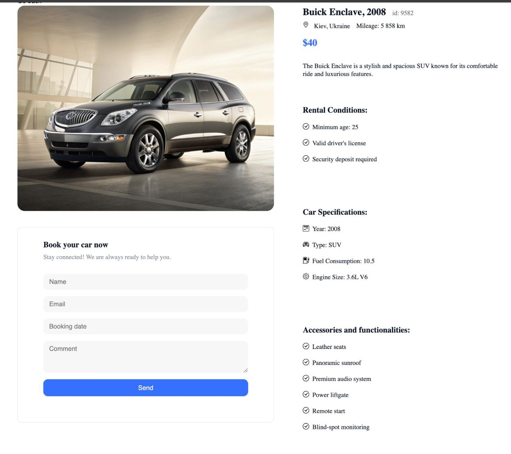
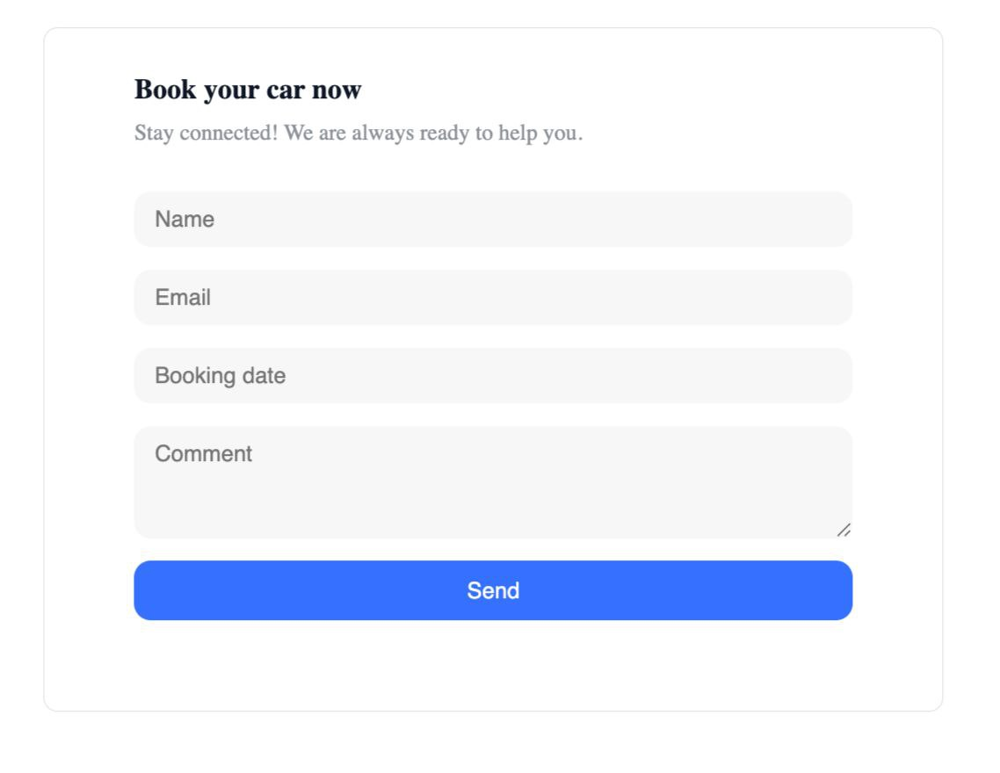

**Rental Car**
Rental Car — an online car rental service.
A platform for searching, filtering, and booking rental cars. Users can browse the car catalog, filter by brand, price, and mileage, and add favorite models to their “Favorites” list.

Main functions

- Search for cars by specified criteria (brand, price, mileage)

  

- View detailed information about the selected car

  

- Booking system

  

Installation instructions:

- Clone the repository;
- Go to the project directory;
- Install dependencies: npm install;
- Run the project: npm run dev.

Author: Stupka Nataliia https://github.com/NataliaStupka
